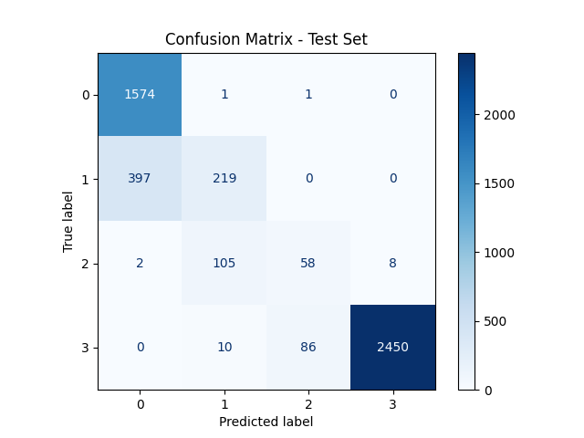

# COVID-19 Mortality Prediction using Shallow Neural Network

This repository contains **Assignment 0 Part II** from the **CSE 676 – Deep Learning** course, University at Buffalo.  
The project builds, trains, and evaluates a simple **Multilayer Perceptron (MLP)** model to predict mortality rates from the official **CDC COVID-19 Provisional Death Counts** dataset.

---

## 📘 Project Overview

The objective of this assignment was to implement an end-to-end deep learning pipeline **from raw data to evaluation**, without using high-level frameworks such as Keras.  
The dataset includes demographic and geographic statistics related to COVID-19 deaths by jurisdiction in the U.S.

### Core Steps
1. **Data Import & Preprocessing**  
   - Read the CDC dataset (`.csv` file).  
   - Handle missing values, normalization, and categorical encoding.  
   - Apply **quantile binning (`qcut`)** to categorize mortality rates (optional flag `--use_qcut`).

2. **Model Definition – Base MLP**  
   - Input layer → Hidden layer (ReLU activation) → Output layer (Softmax).  
   - Implemented manually in PyTorch with custom forward and backward logic.  
   - Optimization via Adam optimizer and Cross-Entropy Loss.

3. **Training & Validation Loop**  
   - Train for a fixed number of epochs (`--epochs`, default = 40).  
   - Evaluate after each epoch to monitor overfitting.  
   - Early stopping if validation loss plateaus.

4. **Evaluation & Visualization**  
   - Compute **Test Accuracy**, **Confusion Matrix**, and **Correlation Heatmap** between features.  
   - Save training artifacts (`model.pt`, plots) in the `artifacts/` directory.  

---

## 📊 Dataset

**File:** `Provisional_COVID-19_death_counts__rates__and_percent_of_total_deaths__by_jurisdiction_of_residence.csv`  
**Source:** [CDC Open Data Portal](https://data.cdc.gov/NCHS/Provisional-COVID-19-Death-Counts-by-Week-Ending-Date-and-St/9dzk-mvmi)

**Key Columns Used**
| Category | Example Features |
|-----------|-----------------|
| Jurisdiction | State / Territory |
| COVID-19 Deaths | Number of reported deaths |
| Total Deaths | All-cause deaths |
| Percent of Total | Share of COVID deaths |
| Crude Rate | Deaths per 100k population |

---

## 🧮 Model Performance

| Metric | Value |
|:--|:--|
| **Train Accuracy (Epoch 0)** | 51.42 % |
| **Train Accuracy (Epoch 10)** | 81.34 % |
| **Train Accuracy (Epoch 20)** | 89.72 % |
| **Train Accuracy (Epoch 30)** | 94.72 % |
| **Final Test Accuracy** | **87.58 %** ✅ |

**Confusion Matrix – Test Set**



---

## ⚙️ Usage

### 1️⃣ Install Dependencies
```bash
pip install -r requirements.txt
